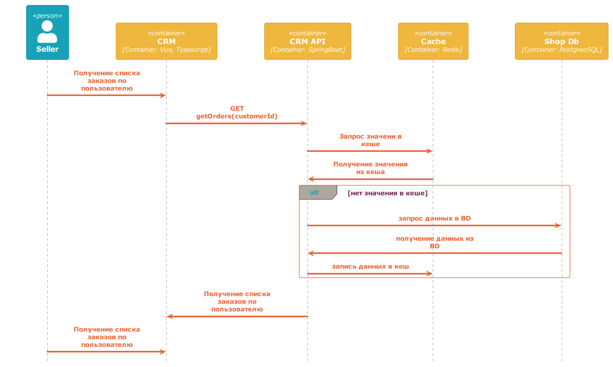

# Архитектурное решение по кешированию

### Мотивация
Использование кеширования существенно снизит нагрузку на наши бэковые сервера и базы данных, что позволит обслуживать больший поток клиентов при тех же затратах на оборудование

### Предлагаемое решение
Керование будем применять:
- клиентское кеширование для наших веб-интерфейсов (InternetShop, CRM и MES)
- серверное кеширование на наших бэковых серверах (MES API, CRM API, Shop API). Начать стоит с MES API, т.к., по описанию, в этом месте у нас больше всего жалоб на меденную работу. Использовать будем только кешировать запросов на получение данных, т.к. исходя из описания системы количество запросов на чтение данных у нас должно существенно превышать количество записей данных. 
Для хранения серверно кеша будем использовать Redis.
Для серверного кеширования как основной паттерн будем использовать cache-aside как достаточно простой, но в то же время не снижающих надежность приложения.
Но для пары мест (например получение списка новых заказов на главной странице) будем использовать refres-ahead, что позволит существенно снизить нагрузку, но исключить риск несогласованности получаемых клиентами данных.
Использование кеширования для операций записи делать как минимум на первом этапе делать не будем, т.к. операций чтения в нашей системе существенно ниже, чем операций чтения. Что характерно для любой информционной системы автоматизирующей какой-либо процесс. В нашем случае процесс получения и обработки заказов.
В качестве способа инвалидации кеша будем использовать один из простых вариантов - временную инвалидацию, что очень удобно при использвании Redis и позволяет это сделать достаточно просто и быстро. 

Раз у нас серверно кеширование используется только при чтении данных, приведу (Sequence diagram) только для этой части для refres-ahead

